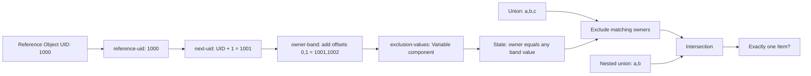

# Native filter: chained Variables and nested population selection

Read [Assessment](../content/filter.assessment.yaml), [expectations](../expected/filter.json),
[inspiration](../sources/filter.xml), and [provenance](../provenance/filter.json).
Human status: **pending-review**. Provenance: Adapted inspiration / Common native content.

This is **native authored**, not equivalent to source Definition `def:276` or its
criterion `tst:451`. The source's omitted filter action means exclude. Its comments
describe three directories, but `obj:189` selects `/opt/support/txt` with nil
filename and `recurse_direction="none"`; `max_depth="-1"` does not turn recursion
on. Executable selection is authority, rather than the misleading comments.

The native example selects four explicit paths with `filesystem: local`: files
`a`, `b`, `c`, and an independent `reference` file. There is no traversal or
shellcommand. The reference file supplies the observed UID; it is not an
Organizational Input and cannot change which Tests execute.

This deliberately exercises an Object component, four dependent local Variables,
two constant inputs, Cartesian arithmetic and a shared Variable component. For a
reference UID of 1000 the intermediate values are `[1000]`, `[1001]`,
`[1001,1002]`, and `[1001,1002]`. They are independently specified in the case
table and recomputed by the bounded helper. The independent reference Object
keeps the graph acyclic: deriving the exclusion band from the filtered Object
itself would create a forbidden collection/Variable dependency cycle.

`variable_match: any` compares each observed owner with either computed UID.
The operand filter excludes matching Items **before** intersection with the
nested union of `a` and `b`. Item identities are reused across Objects, so
Set membership does not duplicate observations. The final Test has no State:
its `check_existence: one` asks whether exactly one Item survives selection.
This sample makes no general ownership-hardening claim.

| Synthetic case | Independent reasoning | Result |
| --- | --- | --- |
| a=0, b=1001, c=1002; reference=1000 | Exclude b,c; `{a}` intersect `{a,b}` is `{a}` | true |
| b changed to 0 | a,b survive both operands; two Items | false |
| b owner not collected | Filter State unknown cannot be coerced to include/exclude; filtered Object error | error |
| c changed to 0 | a,c survive filtering; intersection removes c, leaving a | true |
| Reference acquisition error | Object-component error propagates through the Variable chain and filter | error |

The fourth case distinguishes nested intersection from simply counting the
filtered union. The fifth checks error propagation across the full daisy chain.
All supplied Items and collection flags are **synthetic**. The helper exercises
these arithmetic, filter, Set, identity and cardinality interactions; it does not
execute selectors or establish filesystem locality, permission/link behavior,
collector efficiency or scanner equivalence.
