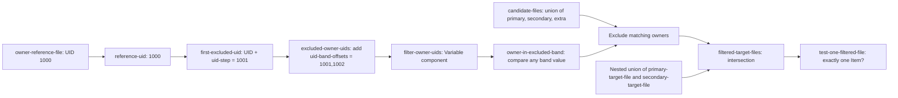

# Native filter: chained Variables and nested population selection

Read [Assessment](../content/filter.assessment.yaml), [expectations](../expected/filter.json),
[inspiration](../sources/filter.xml), and [provenance](../provenance/filter.json).
Human status: **pending-review**. Provenance: Adapted inspiration / Common native content.

This is **native authored**, not equivalent to source Definition `def:276` or its
criterion `tst:451`. The source's omitted filter action means exclude. Its comments
describe three directories, but `obj:189` selects `/opt/support/txt` with nil
filename and `recurse_direction="none"`; `max_depth="-1"` does not turn recursion
on. Executable selection is authority, rather than the misleading comments.

The Object IDs describe their collection roles; they do not imply that an
observed owner already satisfies a requirement. The literal fixture paths stay
unchanged so this revision changes naming alone.

| Object ID | Exact selected path | Role |
| --- | --- | --- |
| `primary-target-file` | `/fixture/a` | First member of the target-file pair |
| `secondary-target-file` | `/fixture/b` | Second member of the target-file pair |
| `extra-candidate-file` | `/fixture/c` | Candidate outside that pair; exercises intersection |
| `owner-reference-file` | `/fixture/reference` | Supplies the observed UID for the Variable chain |

All four selectors use `filesystem: local`. There is no traversal or
shellcommand. The reference file supplies an observation, not an Organizational
Input, and cannot change which Tests execute.

This deliberately exercises an Object component, four dependent local Variables,
two constant inputs, Cartesian arithmetic and a shared Variable component. For a
reference UID of 1000 the intermediate values are `[1000]`, `[1001]`,
`[1001,1002]`, and `[1001,1002]`. They are independently specified in the case
table and recomputed by the bounded helper. The independent reference Object
keeps the graph acyclic: deriving the exclusion band from the filtered Object
itself would create a forbidden collection/Variable dependency cycle.

`variable_match: any` compares each observed owner with either computed UID.
The operand filter excludes matching Items **before** intersection with the
nested union of `primary-target-file` and `secondary-target-file`. Item identities
are reused across Objects, so Set membership does not duplicate observations. The final Test has no State:
its `check_existence: one` asks whether exactly one Item survives selection.
This sample makes no general ownership-hardening claim.

In this table, primary, secondary and extra refer to the corresponding named
file Objects above; the numbers are observed owner UIDs.

| Synthetic case | Independent reasoning | Result |
| --- | --- | --- |
| Primary=0, secondary=1001, extra=1002; reference=1000 | Exclude secondary and extra; intersection retains primary | true |
| Secondary changed to 0 | Primary and secondary survive both operands; two Items | false |
| Secondary owner not collected | Filter State unknown cannot be coerced to include/exclude; filtered Object error | error |
| Extra changed to 0 | Primary and extra survive filtering; intersection removes extra | true |
| Reference acquisition error | Object-component error propagates through the Variable chain and filter | error |

The fourth case distinguishes nested intersection from simply counting the
filtered union. The fifth checks error propagation across the full daisy chain.
All supplied Items and collection flags are **synthetic**. The helper exercises
these arithmetic, filter, Set, identity and cardinality interactions; it does not
execute selectors or establish filesystem locality, permission/link behavior,
collector efficiency or scanner equivalence.
