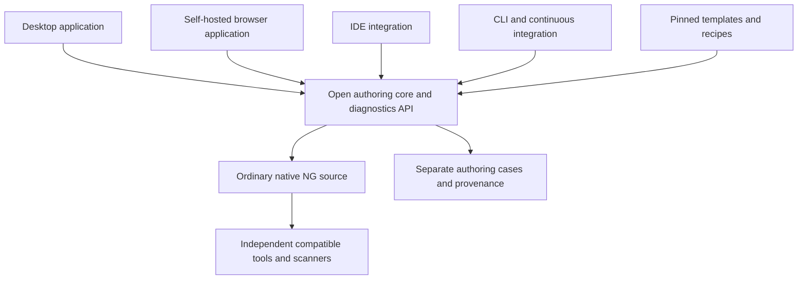

# An open authoring workbench with recipes and templates

Owner's latest requirement: [complete content support](FULL-COVERAGE.md), including
deep Variable/Object/Filter/Set graphs. Guided views are conveniences; preserve-only
or raw-text fallback does not establish full structured authoring support. The
[current obligation inventory](authoring-obligations.json) has no implemented-editor
coverage. Complete model handling takes priority over recipes/packaging.

**Experimental brainstorming, 2026-10-03.** Owner requested expanding the editor
idea using the preceding research, including recipes/templates and an open-source
tool reusable in multiple environments. These are proposals, not accepted schema,
implementation, product decisions or measured usability claims. Receiving checkout:
`vanderpol/scap-ng`, `main`, `b13f665be9b39e7f0f19825954fe33632f4e5c3d`, clean.

Recommendation: investigate an **open authoring workbench** whose simple forms,
tables and readable requirement view edit ordinary native NG content. A common
library/CLI provides model handling and diagnostics; different applications can
reuse it. Versioned recipes are optional authoring aids. A scanner executes the
resulting Assessment without needing the editor or its recipe catalog.

This develops [the ten earlier concepts](../concepts-04/README.md) using the
[full 736-rule reading](../requirements-05/README.md). It does not implement an
editor/compiler/scanner, change established schemas or create an external review
tree. `review/current/` remains the sole external review surface.

Continuation: [language, deployment and Git integration recommendation](IMPLEMENTATION-OPTIONS.md)
responds to the owner's preference for a separate research repository and direct
editing of straightforward content. It proposes a TypeScript/React core/UI and
local desktop product, reusing current Python validators through an adapter.
Technology and repository name remain recommendations, not accepted implementation
or measured coverage decisions.

## The author should see Objects and requirements

A beginner need not start by laying out a graph of node references. A useful first
screen can present four connected questions:

1. **Which Objects?** Registry setting, user accounts, selected files, services,
   directory objects, DNS zones, or records returned by a fixed query.
2. **Which fact?** Explicit setting, effective value, running behavior, enforced
   policy, ownership, configured permission entries or actual access rights.
3. **What must be true?** Equality/range, every/any, only/includes/empty,
   same-parent relationships, or a supported more advanced native expression.
4. **What if observation is missing or unsuccessful?** Show the precise existence,
   cardinality and result semantics. Never make “missing” include unreadable.

These are a UI view, not new native fields or replacement OVAL terminology. The
advanced view retains Assessment, Object, Variable, State, Test and evaluate.
Applicability is visible as a separate linked Assessment. Rule choices/defaults,
Benchmark Profiles and delegated Organizational Inputs have their own views.

Illustrative form derived from Windows SV-278109 (001.001.001):

```text
Object: machine registry, selected view
Path: SOFTWARE\Policies\Microsoft\Windows\Explorer
Value: NoDataExecutionPrevention
Stored type: DWORD
Requirement: equals 0
Confirmed missing value: acceptable under this source requirement
Cannot read value: retain collection error; do not treat as missing

Preview cases:
  DWORD 0 -> satisfies the selected value condition
  DWORD 1 -> finding
  confirmed absent -> permitted absence
  access denied -> collection error
```

The actual source also needs full hive, identity, scope and native result contract;
the form cannot invent those. Adjacent registry checks may FAIL on absence, so a
recipe does not inherit this setting's allowance. The form is not yet executable.

A more ambitious human view:

```text
For each selected interactive user:
  The user's home exists.
  Its group ID equals that user's primary group ID.
```

RHEL SV-258052/258053 motivates that relationship. The editor should explain scope
and preserve the association, not hide a cross-user match. Existing Objects,
Variables and comparisons must be investigated first; this view does not prove
that current native syntax already supports an easy exact lowering.

## Different reusable assets solve different jobs

| Asset | Meaning | How updates behave |
| --- | --- | --- |
| Template | An editable starter: a Rule/Assessment skeleton, examples, questions and cases | Copied content belongs to the author; later template edits do not rewrite it |
| Authoring recipe | A versioned, typed construction for a defined pattern, potentially generating several native nodes | Explicit regeneration with semantic diff and cases; may be detached |
| Observation recipe | A documented/tested way to obtain specific facts through existing native capabilities or a fixed supported query | Acquisition/interpretation contract is versioned; no opaque “compliant” verdict |
| Shared native Assessment | The same technical requirement intentionally referenced by multiple Rules | Normal native identity/reference/version discipline; independent Rule policy/provenance preserved |

Do not build everything as a copy-and-paste template. Shared Assessments and named
Objects reduce ongoing duplication where complete semantics actually match.
Conversely, shared observation shape or similar titles do not prove Assessment
equivalence. Source/manual discrepancies remain explicit.

An observation recipe is not automatically a new scanner provider/plugin API.
It may be documentation plus existing native fragments and fixtures. New provider
interfaces require separately evidenced gaps. Recipes that call a new runtime
operation cannot claim to be merely compiling into the established format.

## A useful initial recipe library

| Recipe candidate | What the author supplies | Essential boundary | Evidence anchor |
| --- | --- | --- | --- |
| Registry setting | Full identity/view, stored and compared datatype, expectation, absence policy | Per-user versus machine scope; errors distinct from absence | Windows SV-278080/278109/278181 |
| Numeric setting with sentinel | Units, permitted range and meaning of 0 | Zero can mean disabled or admin-only release | Windows SV-278033/278034/278037 |
| Right-assignment list | Only/includes/empty plus allowed/required stable principals | Domain identity, role-scoped exceptions, supported userright semantics | Windows SV-278166/278168/278170/278249 |
| File permission allowance | Native discovered population and actual allowed permission bits | POSIX only; not Windows ACL/SACL | Earlier SV-257889 bounded predicate experiment |
| Service status | Actual observed property: installed, startup, active, masked | Do not substitute one property for another | RHEL service reading; Windows SV-285313 |
| Runtime security property | Fixed supported observation and required properties | Registry configured != running | Windows SV-278090/278190 |
| Per-parent record requirement | Parent key, required children/values, multiplicity/completeness | Wrong-parent witnesses and partial collection | DNS dossiers; RHEL home-group relationship |
| Scoped configuration occurrence | Grammar, context, every/any and explicit presence | Native include acquisition; no whole-file key conflation | RHEL SV-258146–258148; Apache dossiers |
| Finite expected resource map | Publisher-owned identities, types and expectations | Every missing expected resource has its own obligation | RHEL SV-258236; manual13/automated12 discrepancy |
| Mixed evidence requirement | Automated observations and source-required process evidence | Documentation/approval is not technical proof | Windows SV-277990/278013/278014 |

This is a candidate library, not ten proven generators. Start with registry and
simple rights views; existing unix.file is a useful native-preservation slice.
Home relationships, sequence, storage ancestry and user-profile collection remain
later semantic research. Recipes SHALL NOT introduce effectively deprecated Tests
or restrict valid supported native content to the catalog's common patterns.

## What a recipe should carry

A recipe is more useful than a code snippet when it ships its explanation and
review evidence. Proposed contents:

- Stable identity, version, author, license and compatibility with specific native
  schema/capability/tool versions.
- A plain-language question and explicit scope, fact being observed, exceptions,
  existence/cardinality and actual supported result semantics.
- Typed author-time bindings, distinguishable from publisher Parameters and
  runtime Organizational Input. Required versus delegated values remain explicit.
- Expected native construction, using independently typed Object/State/Test nodes,
  preserving named sharing and meaningful Variable dependencies.
- Positive/negative/boundary/multiple-match cases; missing, incomplete, unknown and
  collection-error observations where relevant. Separate reviewer expectations
  from implementation-derived expectations.
- Explanation/source mapping from human clause to decisive native nodes, plus
  source references and known disagreements in separate evidence.

Pin exact dependencies/content hashes for reproduction. Human-readable names may
change without silently changing semantic identity. No scanner downloads recipes
at runtime. Catalog revisions SHALL NOT silently alter an authored Assessment.
An author's explicit source choices can construct Tests; runtime Organizational
Inputs SHALL NOT choose Tests, scripts or acquisition methods. Tailoring SHALL NOT
override publisher Parameter values.

## Sharing one core across environments



The diagram describes logical reuse, not a claim that the current Python tools run
inside a browser. Existing parser/validator investment argues for investigating a
Python service/library and CLI first; web/desktop/IDE clients can use a documented
local or hosted API. A browser-only engine would require another implementation
or an appropriate portable build, with agreement tests before use. Do not promise
identical behavior merely because frontends share visual components.

The reusable boundary is **open document handling, editing operations, recipe
resolution, diagnostics and fixtures**. Keep it independent of any one UI framework,
cloud account, scanner vendor or hosted catalog. Schemas can help create typed
forms; semantic contracts also need versioned guidance for scope/defaults/order
that JSON Schema alone cannot describe. This UI guidance lives outside executable
policy and must not invent native fields.

Deployment possibilities:

- Windows/Linux/macOS desktop with local files and optional Git integration.
- An organization-hosted browser editor backed by its own service, content storage
  and authentication; public hosting is an optional deployment.
- IDE tooling using the shared diagnostics/refactoring service, potentially LSP
  where its capabilities fit, plus an embedded form/preview pane.
- CLI validating/checking the same repository in CI without a GUI or display.
- Vendor products using the library/API or embedding suitable UI components.
- Offline/air-gapped installations importing pinned recipe bundles and dependencies.

Choose one frontend first. A local authoring core and a small browser UI served on
localhost could test portability without an initial cloud product. Packaging,
Windows behavior, browser-host authentication and true offline behavior require
separate verification. No execution-on-target or reference scanner is required
to start testing the authoring workflow. Target observations can be imported via
explicit compatible fixtures; target adapters remain optional downstream work.

## Native content is the durable author output

Avoid a proprietary editor project file as the only complete representation.
Native YAML stays inspectable, editable and usable without the editor. Keep
recipe bindings, provenance and acceptance cases in separate authoring evidence,
with their exact storage format still a tooling proposal, not new native fields.

Forms and readable views SHALL be derived from the saved native document for
patterns the editor recognizes. A graph view MAY help experts inspect dependencies,
but is not the beginner default. Do not claim arbitrary graphs can be reversibly
converted into recipe forms. An imported advanced graph can remain native-only.

A robust edit model needs a document representation that preserves comments,
identities, references and unedited regions, not just a lossy JSON object obtained
from YAML. Recipe generation is distinct from native editing. Manual native edits
that diverge from a recipe require reconciliation or detachment; never overwrite
them by automatic regeneration. Valid content outside supported widgets SHALL
remain editable in native view or preserved untouched. Unknown incompatible
versions SHALL be reported without destructive save-time normalization.

“Detach recipe” means retain all generated native semantics and independent
components, stop automatic recipe regeneration and keep lineage in evidence. It
does not mean fix every possible underlying scanner defect. Direct native edits
give an author a repair route for recipe mistakes, not a guarantee that all bugs
are author-fixable. Defects in the editor, recipe, shared core or scanner remain
possible and have different ownership.

## Build review and debugging into the experience

Use the same vocabulary to author, review and explain a result. The editor can
show “this change now accepts an absent value” alongside the native diff; reviewers
shouldn't have to infer that from changed check-existence syntax. Semantic diff
is an explanation, not a proof that two complete Assessments are equivalent.

A scenario pane can place good/bad/missing/error observations next to the check.
It should expose a wrong-parent witness, duplicated identity, forbidden grant,
unreadable file or boundary value. Preview results use the applicable native
result domain and collection flags; do not replace them with a new universal
four-state model. Unsupported preview semantics are explicitly unimplemented.
Synthetic preview, schema validation and actual target execution are distinct.

Git-friendly plain files allow review through ordinary GitHub/GitLab workflows.
Shared-Object edits should reveal affected Tests/Rules. Refactorings need stable
IDs, compatible capabilities, atomic reference changes and reversible edits.
Concurrency/conflict handling must not pick a favorable requirement silently.
Native diagnostic locations and recipe version/bindings help maintainers reproduce
a bug; a minimized observation fixture can travel with the report.

Accessibility matters for the target author: keyboard navigation, clear units,
screen-reader labels, color-independent errors and plain-language help. Labels
can be localized while native identities and semantic values stay stable. “More
advanced” should reveal necessary scope/error semantics, not hide them permanently.

## How an open-source ecosystem could work

Publish a small independent toolkit with a reference editor and an open recipe
catalog. Organizational catalogs can extend it locally. Commercial editors may
embed the toolkit, and competing editors should produce mutually readable native
content. That makes the format and content portable even if the original editor
stops being maintained.

A permissive license such as Apache-2.0 is a reasonable candidate for the NEW
toolkit because reuse by government, vendors and community projects is useful;
this is a proposal, not a licensing decision or a statement about existing files.
Reuse of current code and source-derived templates needs compatible existing
terms; an editor's license does not automatically license all catalog content.
Recipes SHOULD declare their own reuse terms and attributable source provenance.

Distinguish official project recipes, publisher/vendor recipes and community or
organization recipes. Explain evidence per version: structurally checked,
semantically fixture-tested, target-tested against named versions, or unproven.
Do not display a broad “certified compliant” badge from schema success. Public
contribution review can run common fixtures and interoperability checks; maintainers
review semantic changes and versions. Standards governance approves language
semantics; toolkit/catalog maintainers govern implementation releases. One editor
should not become mandatory for standards conformance.

Default to data-driven templates and reviewed deterministic native constructions.
Executable third-party editor plugins are a separate, explicit trust boundary;
opening content SHALL NOT run arbitrary catalog code or scan targets. No silent
plugin downloads or command execution during rendering. Existing shellcommand
remains a legitimate Assessment method for fixed administrative queries, not an
authoring-plugin escape hatch for arbitrary organizational commands.

## A bounded experiment before a large product

First compare two ways of editing the same current native slice: direct typed
forms and optional recipes. Use explicit registry absence contrasts, POSIX file
bits and supported user-right set distinctions when their native mappings are
ready. Do not invent unsupported fields to make the prototype look complete.

An initial test SHOULD have authors create a check, explain its scope and
missing/error behavior, diagnose a false pass, review a policy change, edit native
content and detach a recipe. Measure accuracy and comprehension as well as time.
No present research establishes how an average author will perform.

For a shared toolkit, verify the same files/operations through the CLI and first
UI, import/manual-edit/round-trip preservation, named sharing, unsupported valid
forms, deterministic recipe expansion, version pinning and native escape. Later
add an IDE client and cross-platform packaging. Cross-frontend agreement can
still share a common bug, so independent source-semantic expectations remain
necessary. A target-tested runtime recipe needs independent old/new execution.

Rejected: a mandatory visual graph language; opaque “STIG compliant” buttons;
templates silently upgraded in authored content; arbitrary natural-language runtime
execution; a recipe catalog required by scanners; native content only in a hosted
service; unsupported graph forms dropped by a form editor; source anomalies
silently repaired; filesystem discovery through shellcommand; organization inputs
changing commands/Tests; POSIX proofs generalized to Windows ACLs.

All filesystem searching SHALL remain native-scanner-owned, preserving remote
filesystem exclusions, efficiencies, permissions, links/junctions and collection
behavior. Benchmark→Rule→Assessment and separate applicability remain intact.
No effectively deprecated Test is supported or rare supported feature removed.

## Evidence and resumption

Established: existing native design; twelve detailed source dossiers; bounded
permission transform/source-predicate evidence; full RHEL/Windows Check Text
interpretations. Inferred: domain-oriented forms and reusable recipes could reduce
authoring burden and be shared across products. Unproven: actual usability,
arbitrary native edit preservation, portable UI/API, recipe catalogs, interoperability,
implementation cost and scanner-equivalent runtime observations. No code or
semantic/target tests were run in this documentation-only brainstorming wave.

Provenance: **Inherited** current architecture/terminology and pinned research;
**Adapted** prior editor/helper/acceptance-case concepts into a portable toolkit
proposal; **Common** template/recipe lifecycle, multi-frontend and ecosystem ideas;
**Evidence/Audit** explicit costs, limitations, rejected approaches and handoff.
See [decision candidates](DECISIONS.md) and [handoff](HANDOFF.md). No Board vote,
new backlog issue, accepted design/schema or review-build change was made.
